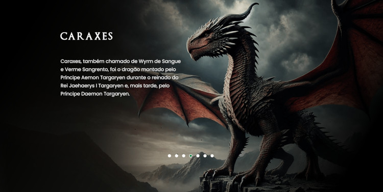

 # 

<h1 align="center"> Dragons from House of the Dragon </h1>

   

O projeto "Dragões de House of the Dragon" envolve o desenvolvimento de uma página interativa que apresenta informações sobre os dragões da série House of the Dragon. A página destacará o nome de cada dragão e seu respectivo cavaleiro, oferecendo uma experiência envolvente e informativa para os fãs da série.

 

Este foi o projeto da <strong>Semana do Zero ao Programador Contratado</strong>, projetado pelos irmão do <a href="https://www.instagram.com/devemdobro/">Dev em Dobro</a>.

 

<a href="https://willalmeid.github.io/dragons-house-of-the-dragon/">Acesse o projeto</a>

## 🤖 Tecnologias

Esse projeto utilizou as seguinte tecnoloogias:
 - HTML e CSS
 - JavaScript
 - Git e GitHub

## 📃 Licença

Esse projeto está sob a licença MIT.

---

Desenvolvido por <a href="https://www.linkedin.com/in/william-almeida-74ab22302/">William Almeida</a>

